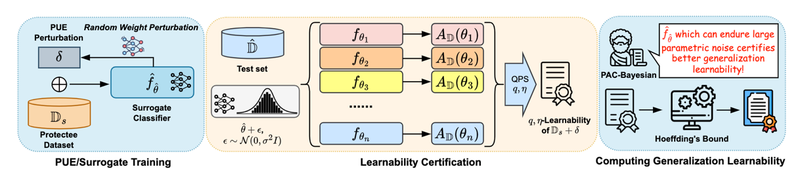

We introduce the concept of certified learnability in this paper. Certified $(q,\eta)$-Learnability measures how learnable a dataset is by computing a probabilistic upper bound on the test performance of classifiers trained on this dataset, as long as those classifiers fall within a certified parameter set. We use certified $(q,\eta)$-Learnability as a measurement of the effectiveness and robustness of unlearnable examples, and propose Provably Unlearnable Examples (PUEs) which can lead to reduced $(q,\eta)$-Learnability when training classifiers on them.